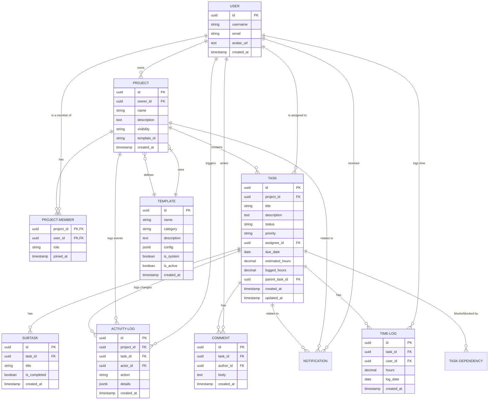

ProFlow is a task management tracker for software projects.

Overview
It support two types of projects

| **type**   | **visibility** | **use case**                                     |
| ---------- | -------------- | ------------------------------------------------ |
| OpenSource | Public         | Community-driven projects, external contributors |
| Private    | Invite-only    | Internal team only, proprietary work             |

Core Concepts
Project Roles

| Role   | Permission                                                                     |
| ------ | ------------------------------------------------------------------------------ |
| owner  | Full Control, can delete project, manage all members, change settings          |
| Admin  | can manage members , edit project settings, create/edit/delete any task        |
| Editor | Can create/edit tasks, assign tasks, add comments, move tasks through workflow |
| viewer | can view tasks, add comments, cannot modify tasks or project settings          |

Task LifeCycle (workflow)

```
Backlog → To Do → In Progress → In Review → Done → Archived
                              (can move backwards too)
```

### Task Structure

```
Task
├── Subtasks (checklist items)
├── Dependencies (blocks / blocked by)
├── Comments (with @mentions)
├── Time logs
└── Activity history
```

---

## Features

| Feature               | Description                                                                     |
| --------------------- | ------------------------------------------------------------------------------- |
| **Project Templates** | Pre-built setups: "Sprint Cycle", "Bug Triage", "Open Source Library", "Custom" |
| **Notifications**     | In-app, email, and webhook alerts for assignments, @mentions, status changes    |
| **Time Tracking**     | Estimated vs. actual hours per task and project                                 |
| **Activity Log**      | Full audit trail of who changed what and when                                   |
| **@Mentions**         | Tag users in comments to notify them                                            |
| **Due Dates**         | Task deadlines with overdue indicators                                          |
| **Priority Levels**   | Low, Medium, High, Critical                                                     |
| **Labels/Tags**       | Custom categorization (e.g., "bug", "feature", "good first issue")              |
| **Search & Filter**   | Find tasks by assignee, status, label, due date                                 |
| **Dashboard**         | Project health metrics, velocity charts, burn down                              |
| **Integrations**      | GitHub/GitLab sync, Slack/Discord webhooks, Calendar export                     |
|                       |                                                                                 |

---

## Data Model

### Entity Relationship


┌─────────────┐ ┌─────────────┐ ┌─────────────┐
│ User        │ │ Project     │ │ Task        │
├─────────────┤ ├─────────────┤ ├─────────────┤
│ id          │◄┤ owner_id    │◄┤ project_id  │
│ username    │ │ name        │ │ title       │
│ email       │ │ visibility  │ │ description │
│ avatar_url  │ │ template_id │ │ status      │
│ created_at  │ │ created_at  │ │ priority    │
└─────────────┘ └─────────────┘ │ assignee_id │
                              ▲ │ due_date    │
                              │ │ estimated_hr│
         │┌─────────────┐       │ logged_hr   │
  └───────┤ Comment     │       │ parent_id   │
         ├─────────────┤        │ blocked_by  │
         │ id          │        │ created_at  │
         │ task_id     │        │ updated_at  │
         │ author_id   │        └─────────────┘
         │ body        │              ▲
         │ mentions    │              │
         │ created_at  │ ┌────────────┴─────────┐
         └─────────────┘ │ Subtask              │
                           ├────────────────────┤
                           │ id                 │
                           │ task_id            │
                           │ title              │
                           │ is_completed       │
                           └────────────────────┘

┌─────────────┐ ┌─────────────┐ ┌─────────────┐
│ProjectMember│ │ActivityLog  │ │ TimeLog     │
├─────────────┤ ├─────────────┤ ├─────────────┤
│ project_id  │ │ id          │ │ id          │
│ user_id     │ │ project_id  │ │ task_id     │
│ role        │ │ task_id     │ │ user_id     │
│ joined_at   │ │ actor_id    │ │ hours       │
└─────────────┘ │ action      │ │ date        │
                │ details     │ └─────────────┘
                │ created_at  │
                └─────────────┘

┌─────────────┐
│ Template    │
├─────────────┤
│ id          │
│ name        │
│ category    │
│ description │
│ config      │
│ is_system   │
│ is_active   │
│ created_at  │
└─────────────┘
```